# Sustainable-Wheat-Production-Datahub
## From Field to Graph: A Semantically Rich Graph-Based Framework for Sustainable Wheat Production

This repository contains the ontology schemas and example datasets for the **GRIP Datahub**, a semantically rich knowledge graph for sustainable wheat production.  
The datahub integrates nutrient management, disease management, climate, and drought information into a modular RDF/OWL framework.

To the best of our knowledge, this is the first unified, wheat-focused agricultural datahub that semantically integrates heterogeneous datasets within a single ontology-driven architecture.

---

## Repository Structure
```
GRIP_DATAHUB/
├─ central-schema/
│   ├─ disease-management/
│   │   ├─ chemical_strategy.ttl
│   │   ├─ cultural_practice.ttl
│   │   ├─ disease-management-schema.ttl
│   │   ├─ fungi_types.ttl
│   │   ├─ host_genetics.ttl
│   │   └─ merged.ttl
│   └─ nutrient-management/
│       ├─ environment.ttl
│       ├─ fertilization.ttl
│       ├─ merged.ttl
│       ├─ nitrogen.ttl
│       ├─ nutrient.ttl
│       └─ soil_available_nitrogen.ttl
├─ external-datasets/
│   ├─ field-trial-data/
│   │   ├─ disease-field-trial-data/
│   │   │   └─ disease-field-trial-data.ttl
│   │   └─ nutrient-field-trial-data/
│   │       └─ nutrient-management-field-trial-data.ttl
│   ├─ hprcc-climate-data/
│   │   ├─ hprcc-climate-data-ks-schema.ttl
│   │   └─ hprcc-climate-data-ks.nt
│   └─ unl-drought-monitor-data/
│       └─ unl-drought-monitor-data.ttl
└─ README.md
```
---
## Central Schema
The `central-schema/` directory contains two subdirectories representing the two major modules of our core ontology: disease management and nutrient management. Rather than storing data, this directory defines the core vocabulary and upper-level concepts that specify what nutrient management and disease management are within the GRIP Datahub.

## Disease Management Module

The `disease-management/` folder contains the ontology components that model fungal pathogens, their characteristics, host genetics, and integrated management strategies.  
Together, these schemas capture how chemical strategies, cultural practices, and wheat variety resistance interact to influence disease outcomes.

- **chemical_strategy.ttl** – Defines fungicide products, active ingredients, application timings, rates, and chemical control strategies.  
- **cultural_practice.ttl** – Represents cultural disease mitigation practices such as residue management, crop rotation, and tillage. 
- **host_genetics.ttl** – Models wheat varieties, genetic resistance traits, and host–pathogen interactions.  
- **fungi_types.ttl** – Provides a vocabulary of fungal species and their relevant biological and environmental properties.
- **disease-management-schema.ttl** – Integrates all disease-related submodules and defines linking relationships among them.  
- **merged.ttl** – A single aggregated file that imports and unifies all disease-management ontology components.


## Nutrient Management Module

The `nutrient-management/` directory contains schemas representing the nutrient hierarchy and the nitrogen-centric modules essential for understanding nutrient dynamics in wheat production.  
These files model nitrogen demand, supply, balance, environmental drivers, fertilization strategies, and soil nitrogen availability.

- **nutrient.ttl** – High-level nutrient classification, including non-minerals, primary/secondary minerals, micronutrients, and other nutrient forms.  
- **nitrogen.ttl** – Defines nitrogen demand, nitrogen supply, nitrogen balance, observational traits, and nitrogen–environment interactions.  
- **soil_available_nitrogen.ttl** – Represents soil nitrogen pools and associated measurement properties.  
- **environment.ttl** – Captures environmental and soil factors (temperature, moisture, pH, etc.) influencing nutrient behavior.  
- **fertilization.ttl** – Models fertilizer treatments, rates, timings, and agronomic nitrogen management strategies.  
- **merged.ttl** – A convenience file that imports all nutrient-management submodules into a unified schema.


## External Datasets

The `external-datasets/` directory contains instance-level datasets that populate the ontology with empirical data from field trials, climate stations, and drought monitoring systems.  
These datasets ground the schema in real agronomic observations and enable SPARQL-driven analysis across multiple environmental and management contexts.
Only a small subset of the full datasets is included in this repository due to their large size, with the remainder stored externally.

### Field Trial Data
- **disease-field-trial-data.ttl** – Empirical field trial data documenting fungicide performance, disease severity ratings, and variety responses.  
- **nutrient-management-field-trial-data.ttl** – Field trial observations related to nitrogen treatments, grain protein, test weight, and yield components.

### HPRCC Climate Data
- **hprcc-climate-data-ks-schema.ttl** – Schema describing climate station metadata and observation structure for the HPRCC dataset.  
- **hprcc-climate-data-ks.nt** – Large N-Triples file containing daily climate observations (temperature, precipitation, snowfall, etc.).

### UNL Drought Monitor Data
- **unl-drought-monitor-data.ttl** – State- and county-level drought category observations spanning multiple years, aligned with the U.S. Drought Monitor classifications.
---

## Schema Diagrams

Below are the high-level diagrams illustrating the modular organization of the GRIP Datahub ontology.  
These figures provide an overview of how the core schema and its two major modules—disease management and nutrient management—are structured and interconnected.

### Nutrient Management Schemas
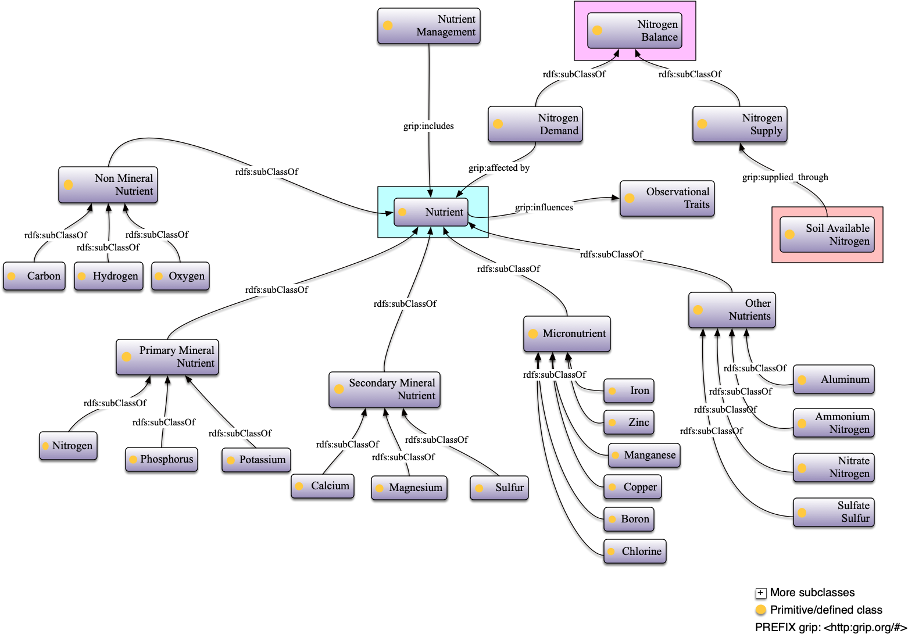

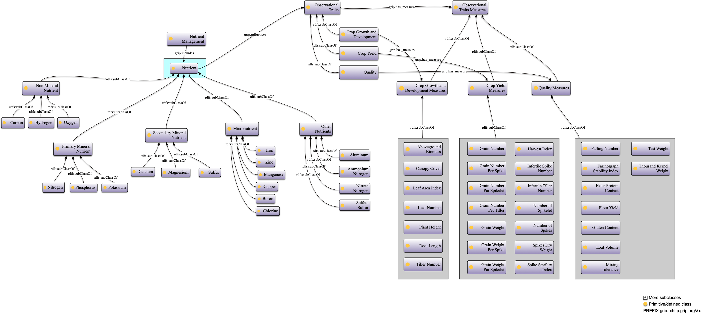

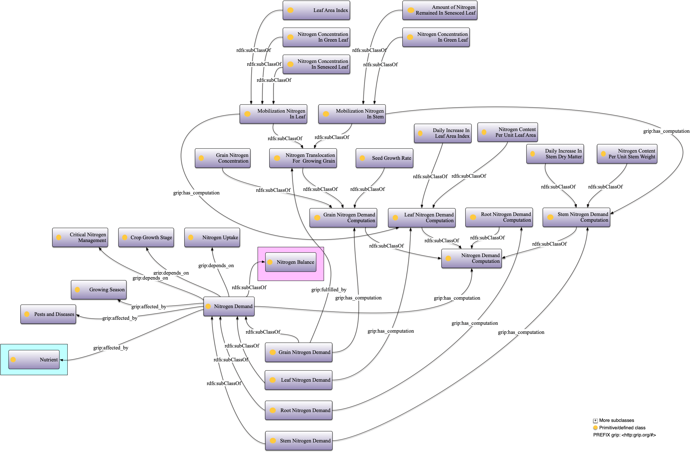

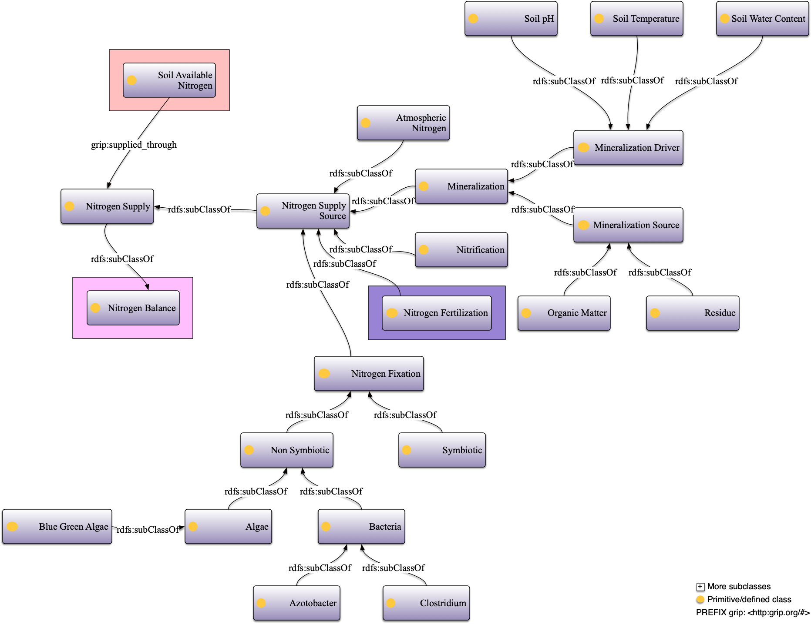

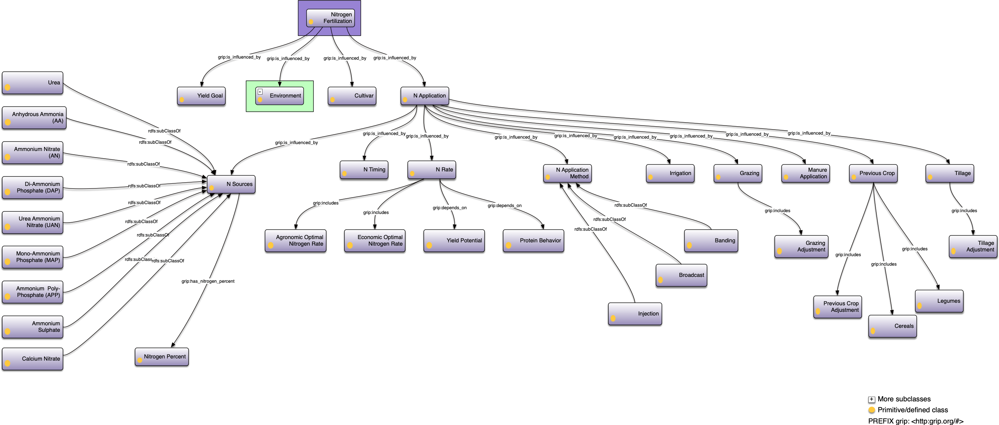

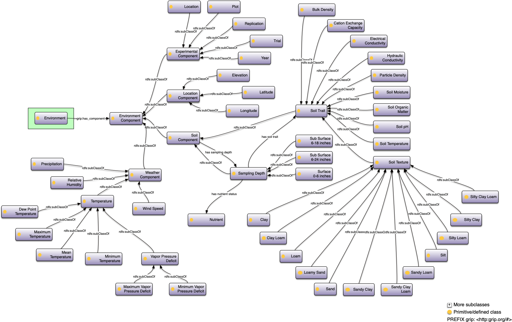

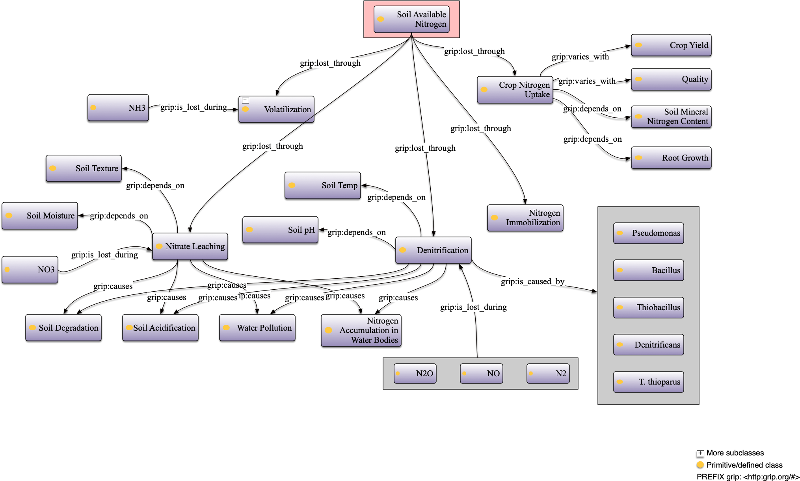

---

### Disease Management Schema
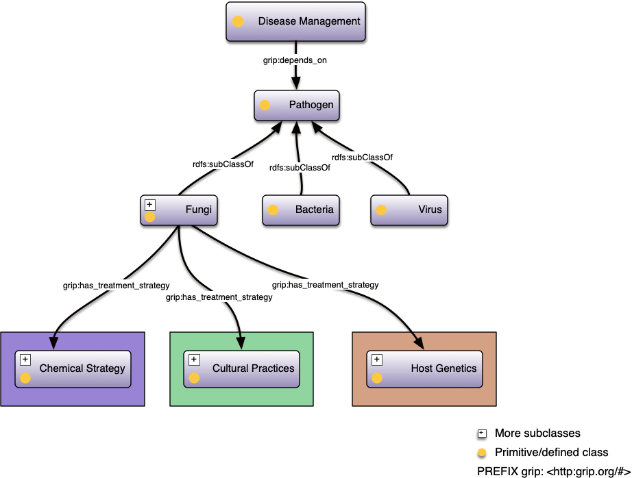

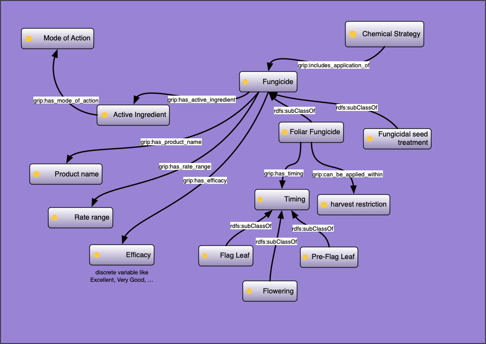

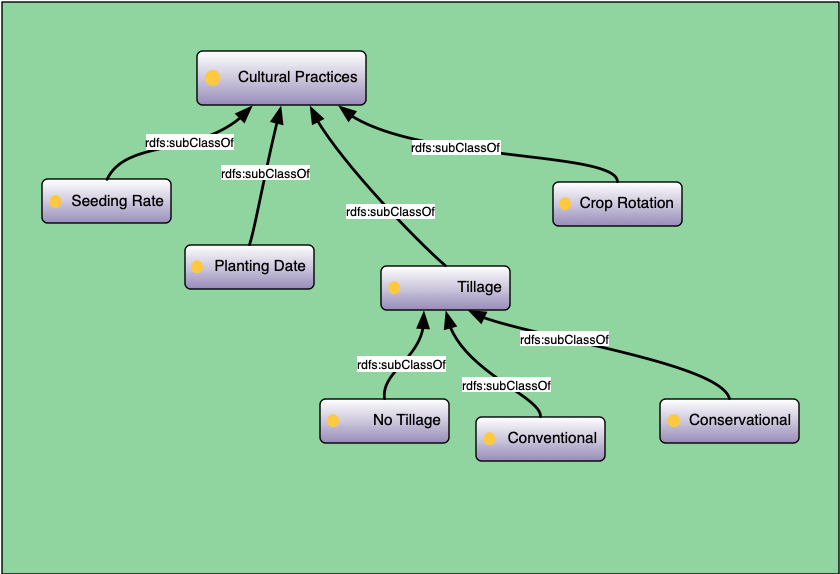

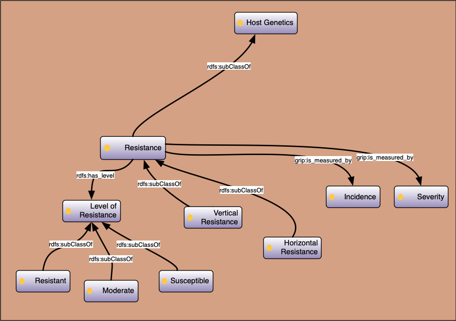

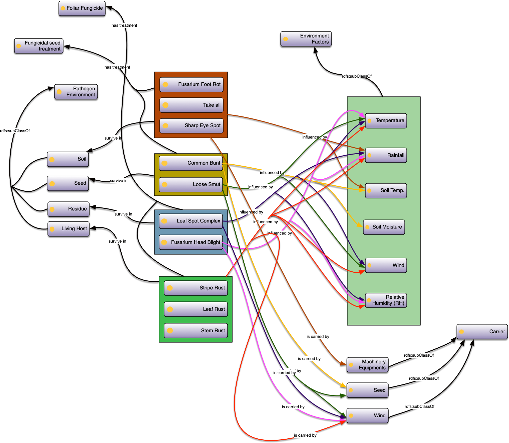

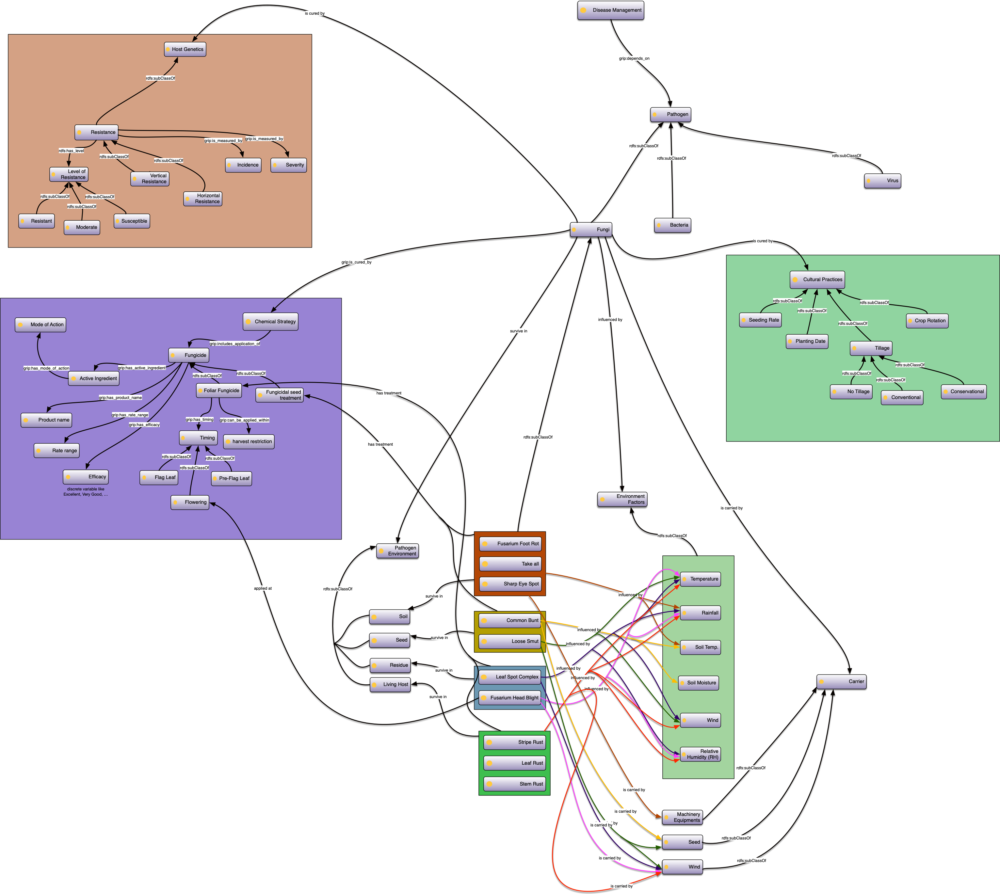

---

### External Datasets' Schema
#### Field-Trial Data
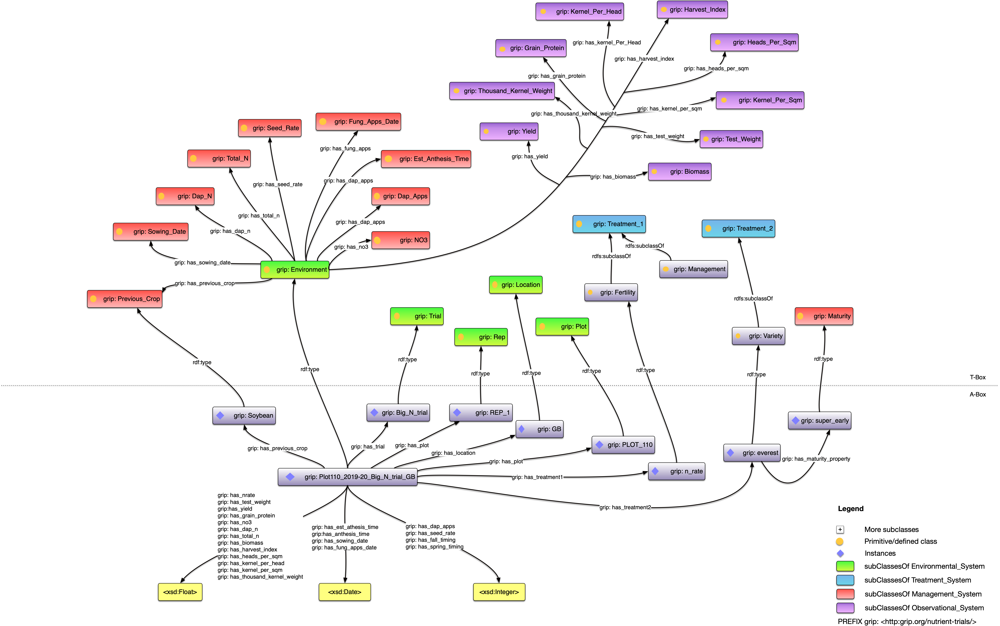

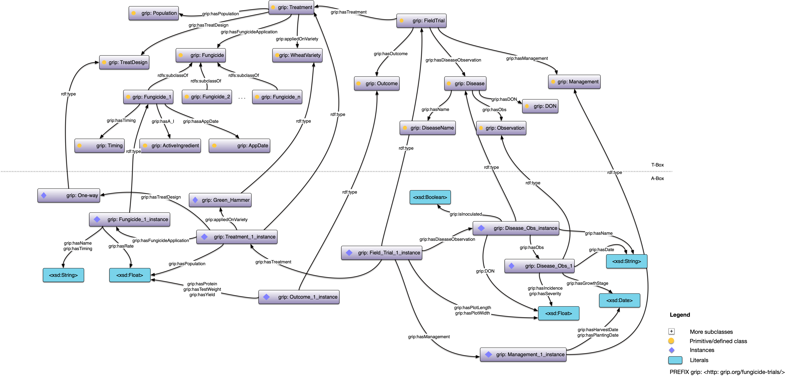

#### Climate Data Schema
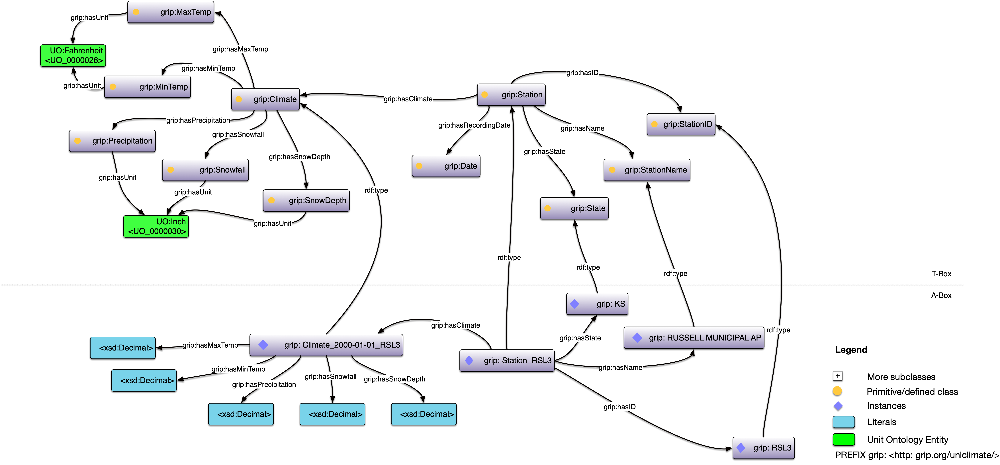

#### Drought Monitor Schema
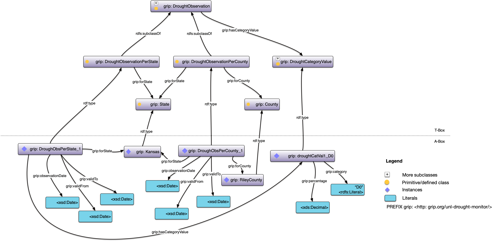
